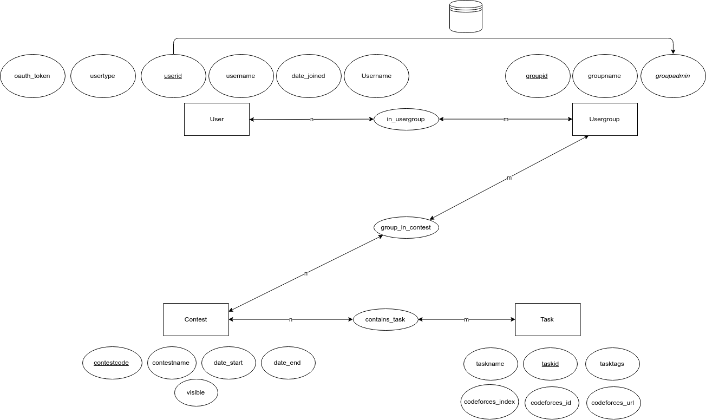
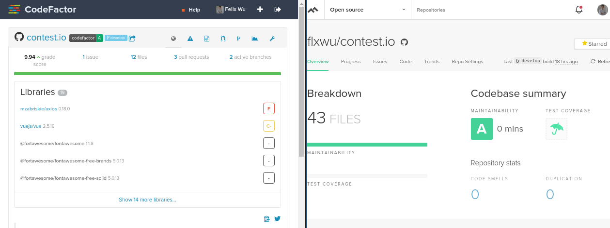

# Table Of Contents

- [1. Abstract](#1-abstract)
- [2. Ausblick](#2-ausblick)
- [3. Dokumentation – Front-End (Vue.js)](#3-dokumentation-%E2%80%93-front-end)
  * [3.1. Das Framework - Vue.js](#31-das-framework---vuejs)
    + [3.1.1. Wozu ein Framework?](#311--wozu-ein-framework)
    + [3.1.2. Warum Vue?](#312--warum-vue)
  * [3.2 Weitere verwendete Bibliotheken](#32--weitere-verwendete-bibliotheken)
- [4. Dokumentation – Back-End (Flask)](#4-dokumentation--back-end-flask)
  * [4.0. Wofür ein Back-End-Framework?](#40-wofur-ein-back-end-framework)
  * [4.1. Warum Flask?](#41-warum-flask)
    + [4.1.1 Weitere verwendete externe Bibliotheken](#411-weitere-verwendete-externe-bibliotheken)
  * [4.2. Security](#42-security)
  * [4.3. Coding Style und Linting](#43-coding-style-und-linting)
  * [4.4 Datenbank](#44-datenbank)
- [5. Continious Integration und Maintanability](#5-continious-integration-und-maintanability)
  * [5.1. Continious Integration](#51-continious-integration)
    + [5.1.1. Travis CI](#511-travis-ci)
    + [5.1.2. CodeFactor und CodeClimate](#512-codefactor-und-codeclimate)

## 1. Abstract   

Contest.io soll eine einfache Plattform zur Erstellung von Programmierwettbewerben sein. Mit einstellbarem Zeitraum und individuelle Zusammenstellung von Aufgaben kann die Plattform auch als Ergänzung zum Unterricht dienen, da passend zum Lernmaterial Aufgaben bereitgestellt werden kann, wo der Lehrer individuellen Vorschritt genau Nachverfolgen kann.   


## 2. Ausblick  

In Zukunft können zusätzliche Funktionen wie zum Beispiel ein Punkte-System und somit ein Rang-System eingeführt werden. Neben Codeforces könne weitere Fragenkataloge angeschlossen werden, um das Aufgabensortiment zu erweitern. Das Aufräumen von Optimieren von code ist ebenfalls möglich, jedoch ist dazu wenig Bedarf, da unser code bereits durch einige Prüfungs-Tools als gut bewertet wurde. Mehrere Möglichkeiten des Einloggens können ebenfalls implementiert werden, sowie erweiterte Profil- und Gruppenfunktionen.


# 3. Dokumentation – Front-End

## 3.1.	Das Framework - ([Vue.js](https://vuejs.org))

### 3.1.1. Was ist das Front-End?	Und Wozu ein Framework?   

Das Front-End beschreibt der Teil einer Webseite, mit dem der User direkt interagiert. Was der User sieht, worin er tippt, worauf er klickt: das alles gehört zum Fronr-End.

Ein Front-End Framework erlaubt das Schaffen dynamische Webseiten und Single-Page-Applications, die für komplexe Web-Apps wie dieses Projekt, wenn nicht unbedingt notwendig, jedenfalls ungemein nützlich sind.  

Das Framework erlaubt auch sogenanntes 'lokal testing', das heißt, dass das Framework problemlos auf dem Computer des Developers einen test-server aufbaut und darauf läuft. Zum testen kann der Devloper nun diesen server per Browser ansteuern und sieht die fertige Webseite, wie sie nach dem finalen 'deploy' (das aufsetzen auf den echten server) aussehen und funktionieren wird. So können bugs erkannt und eliminiert werden.

### 3.1.2.	Warum Vue?  

Für contest.io haben wir uns für das relative neue Framework Vue.js 2.0 entschieden, da es schnell und komprimierter ist und trotzdem große Leistung besitzt. Vue besitzt ebenfalls eine große Community mit vielen hilfreichen Plugins, die einem das Programmieren erleichtern.  

Vue sorgt dafür, dass nur veränderte Komponenten neu vom server geladen werden, und minimiert somit unnötige downloads und Berechnungen. Der Vue-Router erlaubt einfache Navigation von Seiten und verhindert auch unnötigen Web-Traffic.

## 3.2	Weitere verwendete Bibliotheken  

Jedes größere Projekt mit Frameworks benötigt außerdem einige zusätzlichen Tools. Allgemein haben wir ([Vuetify](https://vuetifyjs.com)) als Design-Plugin genommen, welches das standardisierte Google-Material-Design auf die Webseite überträgt. ([Axios](https://github.com/axios/axios)) erlaubt die Verbindung von Front- und Back-End. ([Webpack](https://webpack.js.org)) kompiliert den Vue code, um ihn für den Browser lesbar zu machen. Außerdem wurden einige kleine Plugins wie `vue-moment` auch benutzt.

# 4. Dokumentation – Back-End ([Flask](flask.pocoo.org))

## 4.0. Wofür ein Back-End-Framework?

Das Back-End ist bei einer "Full-Stack"-Webapplikation, also einer Applikation bestehend aus Front-End und Back-End, der Begriff für den Server und den darauf laufende Software. Nun fragt man sich, wofür man denn überhaupt ein Back-End braucht, und das ist eine berechtigte Frage, denn: Lange funktionierten Webseiten ohne Serverstruktur, reine _Client-Websiten_ also. Und auch heute wird wieder mehr auf _serverless-architecture_ gesetzt, auch wenn hierbei letztendlich die Serverarbeit vom Cloud-Provider betrieben wird.

Dass wir uns dennoch für ein Back-End entschieden haben, liegt letztendlich an zwei wesentlichen Gründen:

1. Wir benötigen eine Datenbank für alle unsere Operationen rund um die Aufgaben, Wettbewerbe, Nutzer und Gruppen. Diese aus dieser Datenbank verfügbaren Daten müssen überall gleich und verfügbar sein, egal wo der Nutzer gerade über seinen Client - bzw. das Front-End - auf unseren Dienst zugreift.
2. Echtzeit-Analyse ist nur mit einem Server möglich. In unserem Fall bedeutet dies, dass alle Nutzer zur selben Zeit angezeigt bekommen, wie weit ein Wettbewerb fortgeschritten ist oder wie weit die Mitstreiter sind.

## 4.1. Warum Flask?

Im Vorfeld stand relativ schnell für uns fest, dass wir im Back-End entweder das auf Node.js basierende JavaScript-BackEnd-Framework [Express.js](https://github.com/expressjs/express) oder etwas eher Neues verwenden würden. Express.js hatte den Vorteil, dass wir beide Erfahrung mit JavaScript und dem Framework haben und vor allem der Einstieg deutlich leichter gewesen wäre. Viel entscheidender war jedoch, dass Express.js als JavaScript-Framework deutlich kompatibler mit unserem Front-End Framework Vue.js sein würde.

Dennoch ist es letztendlich Flask geworden, da ich recht gut Python beherrsche und bereits Erfahrung mit [Django](https://djangoproject.com/), einem extrem funktionsreichen und komplexen Python-BackEnd-Framework, hatte, und wir etwas Neues ausprobieren wollten. Jedoch war die Erfahrung mit _Django_ aufgrund der extremen Größe und Komplexität eher negativ und da wir nicht vor hatten, Facebook nachzubauen, entschieden wir uns für die schnellere, einfacher zu erlernende und deutlich unkomplexere Alternative Flask. Nachdem wir also nach einiger Recherche sichergestellt hatten, dass Vue.js und Flask größtenteils reibungsfrei kombinierbar sind, stand diese Entscheidung also fest.

### 4.1.1 Weitere verwendete externe Bibliotheken

- [requests](http://docs.python-requests.org/) - Netzwerkoperationen
- [gunicorn](http://gunicorn.org/) - HTTP Server für Flask
- [autopep8](https://github.com/hhatto/autopep8) - Coding-Style-Convention (s. [hier](#43-coding-style-und-linting))
- [pylint](https://github.com/PyCQA/pylint) - "Linting" (s. [hier](#43-coding-style-und-linting))
- [python-dotenv](https://github.com/theskumar/python-dotenv) - .env support (s. [hier](#42-security))

## 4.2 Datenbank
Folglich ist das ER-Diagramm abgebildet. Als Query-Language dient [Sqlite3](https://www.sqlite.org/)


## 4.3. Dateienstruktur

## 4.4. Security
Da auch wir einige _Secrets_, also "geheime" Schlüssel wie die Api Keys von Github, in unserem Back-End verwenden, entschied ich mich, die [12-factor](http://12factor.net/)-Prinzipien anzuwenden, um diese Schlüssel nicht der Öffentlichkeit zu offenbaren, zumal wir unseren Code öffentlich auf Github hosten.

Aus diesem Grund verwenden wir die Python-Version von `dotenv`, eine ursprünglich für Node.js(JavaScript) entwickelte Software zum Laden von globalen Umgebungsvariablen aus einer `.env` Datei.
Dies bedeutet, wir deklarieren in unseren `.env` Dateien die benötigten _Secrets_:
```bash
GITHUB_CLIENT_ID=...
GITHUB_CLIENT_SECRET=...
SECRET_KEY=...
```
Diese werden dann vom Back-End geladen und benutzt, dabei wird die Datei von Git ignoriert, das heißt jeder inklusive uns, der das Projekt lokal ausprobieren/entwickeln möchte, muss eine solche Datei erstellen, einen eigenen Github Api-Key generieren und diesen einfügen.

## 4.5. Coding Style und Linting
Linting bezeichnet das Analysieren von Code auf potenzielle Fehler, wie vergessene Klammern, falsche Einrückungen oder fehlerhafte Variablendeklerationen.
Dafür wird im Back-End die Software `pylint` benutzt.

Coding Style bezeichnet das Aussehen des Codes - und dafür gibt es Konventionen. Die in Python am weitesten verbreiteste is `autopep8`. Dieses Programm formatiert automatisch den Code und meldet Verstöße gegen die Konvention.


# 5. Continious Integration und Maintainability
Wir haben von Anfang an versucht, unser Projekt möglichst "maintainable" zu halten: Dies bedeutet, dass wir potenziellen Nachfolgern oder Mitprogrammieren den Einstieg durch weitesgehende Automatisierungen vereinfachen.

## 5.1. Continious Integration

Continious Integration beschreibt den automatisierten Prozess des Zusammenfügens, Packetierens, Testens und letztlich Vertriebs der Software.
Wesentliches Ziel ist also die Steigerung der Softwarequalität, da dadurch menschliche Eingriffe in das "Deployment" vermieden werden.

### 5.1.1. Travis CI
Hauptwerkzeug unserer Continious Integration ist der Dienst bzw. die Software [Travis CI](travis-ci.org).

Travis arbeitet mit sogenannten `builds`: In unserem Fall wird ein `build` jedes mal ausgeführt, wenn ein neuer Commit gepusht wird.

Unsere Konfiguration sieht dabei wie folgt aus:
```yaml
matrix:
  include:
    - language: python
      python:
        - "3.6"
      node_js:
        - "node"
      env:
        - FLASK=1.0.2
      install:
        - pip3 install Flask==$FLASK
        - pip3 install -r requirements.txt
        - pip3 install -e .
        - yarn add eslint
        - yarn install
        - cd client/ && yarn install
        - cd ../
      before_script:
        - chmod +x .travis/writetoenv.sh && ./.travis/writetoenv.sh
        - yarn db-rewrite
        - chmod +x .travis/deploy.sh
      script:
        - pylint server
        - cd client/ && yarn lint --fix
        - cd ../
        - cd client/ && yarn build
        # - nosetests
        - cd ../
        - ./.travis/deploy.sh
      cache:
        directories:
          - "node_modules"
          - "client/node_modules"
```

Die Kommandos sind dabei in der POSIX-Sprache `bash`, ebenfalls wie die beiden Skripte `deploy.sh` und `writetoenv.sh`. Im Wesentlichen werden bei jedem `build` folgende Schritte ausgeführt:

1. Alle Front-End und Back-End Abhängigkeiten installiert
2. Die von uns im Travis-CI User-Interface festgesetzten Umgebungsvariablen werden in die `.env` Datei geschrieben um vom Back-End geladen werden zu können
3. Die Datenbank wird kompiliert
4. Sowohl Front-End als auch Back-End werden einem `Linter` unterzogen, das heißt der `build` scheitert wenn Fehler erkannt werden oder wir von unseren Coding-Style Konventionen abgewichen sind.
5. Das Front-End wird kompiliert - aus den vielen Dateien wird eine große komprimierte `.js` Datei (neben den anderen statischen Dateien) gemacht, um das Gesamtpaket klein zu halten und die Performance zu optimieren. Dies ist eine native Funktion von Vue.js.
6. **Wenn der `build` auf der `master` branch ist**, werden die kompilierten sowie von den Lintern überprüften Dateien committed und zurück in unser Repository gepusht. Dies musste in der `bash` Datei [`deploy.sh`](https://github.com/flxwu/contest.io/blob/develop/.travis/deploy.sh) eigenhändig programmiert werden. Ein solcher Commit sieht dann so aus:


**Scheitert einer der Schritte 4-6, wird in Github ein rotes Symbol angezeigt** - so mergen wir unsere Pull-Requests erst, wenn der `build` erfolgreich war, also keine Fehler erkannt wurden und alle Schritte reibungsfrei durchlaufen werden konnten.

### 5.1.2. CodeFactor und CodeClimate
Dies sind beides weitere Tools zur Bewertung und Überprüfung unseres Codes auf mögliche Fehler, Ungereimtheiten und vermeintliche unschöne Passagen wie Wiederholungen etc.


*CodeFactor und CodeClimate Dashboards*
