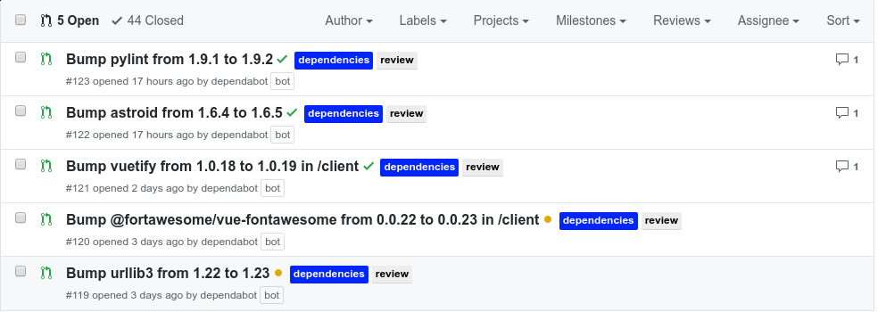

# Table Of Contents

- [1. Abstract](#1-abstract)
    + [1.1. Motivation](#11-motivation)
    + [1.2. Contest.io - Programmierwettbewerbe für den Informatikunterricht und die Privatnutzung](#12-contestio---programmierwettbewerbe-fur-den-informatikunterricht-und-die-privatnutzung)
- [2. Ausblick](#2-ausblick)
- [3. Version Control](#3-version-control)
- [4. Dokumentation – Front-End](#4-dokumentation--front-end)
  * [4.1. Das Framework - Vue.js](#41das-framework---vuejs)
    + [4.1.1. Was ist das Front-End? Und Wozu ein Framework?](#411-was-ist-das-front-endund-wozu-ein-framework)
    + [4.1.2. Warum Vue?](#412--warum-vue)
  * [4.2 Weitere verwendete Bibliotheken](#42--weitere-verwendete-bibliotheken)
  * [4.3 Dateienstruktur](#43--dateienstruktur)
- [5. Dokumentation – Back-End ([Flask](flask.pocoo.org))](#5-dokumentation-%E2%80%93-back-end-flaskflaskpocooorg)
  * [5.0. Wofür ein Back-End-Framework?](#50-wofur-ein-back-end-framework)
  * [5.1. Warum Flask?](#51-warum-flask)
    + [5.1.1 Weitere verwendete externe Bibliotheken](#511-weitere-verwendete-externe-bibliotheken)
  * [5.2 Datenbank](#52-datenbank)
  * [5.4. Dateienstruktur](#54-dateienstruktur)
  * [5.4. Security](#54-security)
  * [5.5. Coding Style und Linting](#55-coding-style-und-linting)
- [6. Continious Integration und Maintainability](#6-continious-integration-und-maintainability)
  * [6.1. Continious Integration](#61-continious-integration)
    + [6.1.1. Travis CI](#611-travis-ci)

## 1. Abstract   

### 1.1. Motivation
Programmierwettbewerbe und die dazugehörenden Plattformen wie **Codeforces** sind unter versierten Informatik(-studenten) sehr beliebt. Nach anfänglicher Testphase hat sich herausgestellt, dass das Konzept, die Aufgaben und die generelle Idee auch vielseitig im Informatikunterricht an der Schule eingesetzt werden kann, jedoch kamen recht früh Probleme auf:

1. Die Runden finden immer zu festen Zeiten statt und sind immer zweistündig, bieten also zeitlich sehr geringe Flexibilität.
2. Viele Aufgaben gehen weit über den Schulstoff hinaus und somit sind nur ein Bruchteil der Aufgaben im schulischen Rahmen lösbar. Dies stellt in sofern ein Problem dar, dass die Codeforces-Runden immer 5-7, nach Schwierigkeit gestaffelte Aufgaben inkludieren, wovon dann für die meisten Schüler nur die ersten beiden realistisch lösbar sind.
3. Es gibt kein "Lehrer-Schüler" System.

Insbesondere unter Betrachtung des dritten Punktes taten sich viele Möglichkeiten auf, eine eigene solche Plattform zu erweitern - Es sollte Gruppen/Klassen geben, in welchen die Admins/Lehrer in Echtzeit mitverfolgen können, wie weit jeder ihrer Schüler ist. So kann der Lehrer eine Runde aus den seiner Meinung nach passenden Aufgaben erstellen, diese seinen Klassen A,B und C zuweisen und innerhalb jeder Klasse mitverfolgen, welche Aufgaben welchen Schülern Probleme bereiten.

### 1.2. Contest.io - Programmierwettbewerbe für den Informatikunterricht und die Privatnutzung
Diese Plattform nannten wir **contest.io**. Contest.io soll die Probleme 1. und 2. durch ein System lösen, in welchem jeder (in erster Linie jedoch die Admins/Lehrer) jederzeit Runden aus selbst erwählten Aufgaben erstellen kann und diese entweder öffentlich - also für jeden zugänglich - oder privat mit fester Zuweisung an Gruppen/Klassen machen kann. Des Weiteren ermöglicht unsere Plattform das bereits erwähnte Analysieren der Leistungen von Gruppen/Klassen.

## 2. Ausblick  

In Zukunft können zusätzliche Erweiterungen wie zum Beispiel Folgende implementiert werden:

- Punkte-System und somit ein Rang-System mit "Elo"
- Einschließen weiterer Fragekataloge neben Codeforces
- Weitere Möglichkeiten des Einloggens 
- Detailliertere und funktionsreichere Profile und Gruppen

# 3. Version Control
Wir verwenden für die Versionskontrolle Git und hosten unser Projekt auf Github unter https://github.com/flxwu/contest.io. Dort befindet sich also sämtlicher zum Setup benötigter Code sowie sämtliche CI-Integrationen und zusätzliche Konfigurationen.
Des Weiteren versuchen wir uns and die [Angular Commit Conventions](https://gist.github.com/stephenparish/9941e89d80e2bc58a153) zu halten, um so eine Struktur in unseren Commits zu haben und leichter Änderungen nachvollziehen und analysieren können. Außerdem lässt sich so leicht ein Changelog aus der Git-Historie automatisiert erstellen.

# 4. Dokumentation – Front-End

## 4.1.	Das Framework - ([Vue.js](https://vuejs.org))

### 4.1.1. Was ist das Front-End?	Und Wozu ein Framework?   

Das Front-End beschreibt der Teil einer Webseite, mit dem der User direkt interagiert. Was der User sieht, worin er tippt, worauf er klickt: das alles gehört zum Fronr-End.

Ein Front-End Framework erlaubt das Schaffen dynamische Webseiten und Single-Page-Applications, die für komplexe Web-Apps wie dieses Projekt, wenn nicht unbedingt notwendig, jedenfalls ungemein nützlich sind.  

Das Framework erlaubt auch sogenanntes 'lokal testing', das heißt, dass das Framework problemlos auf dem Computer des Developers einen test-server aufbaut und darauf läuft. Zum testen kann der Devloper nun diesen server per Browser ansteuern und sieht die fertige Webseite, wie sie nach dem finalen 'deploy' (das aufsetzen auf den echten server) aussehen und funktionieren wird. So können bugs erkannt und eliminiert werden.

### 4.1.2.	Warum Vue?  

Für contest.io haben wir uns für das relative neue Framework Vue.js 2.0 entschieden, da es schnell und komprimierter ist und trotzdem große Leistung besitzt. Vue besitzt ebenfalls eine große Community mit vielen hilfreichen Plugins, die einem das Programmieren erleichtern.  

Vue sorgt dafür, dass nur veränderte Komponenten neu vom server geladen werden, und minimiert somit unnötige downloads und Berechnungen. Der Vue-Router erlaubt einfache Navigation von Seiten und verhindert auch unnötigen Web-Traffic.

## 4.2	Weitere verwendete Bibliotheken  

Jedes größere Projekt mit Frameworks benötigt außerdem einige zusätzlichen Tools. Allgemein haben wir ([Vuetify](https://vuetifyjs.com)) als Design-Plugin genommen, welches das standardisierte Google-Material-Design auf die Webseite überträgt. ([Axios](https://github.com/axios/axios)) erlaubt die Verbindung von Front- und Back-End. ([Webpack](https://webpack.js.org)) kompiliert den Vue code, um ihn für den Browser lesbar zu machen. Außerdem wurden einige kleine Plugins wie `vue-moment` auch benutzt.

## 4.3 Dateienstruktur

Die vue.config.js Datei enthält, wie der Name andeutet, Konfigurationsdaten von Vue. Die index.html Datei, in dem der fertig kompilierte Vue-Code injected wird, befindet sich im Ordner `public`. Der `src`-Ordner enthält rohe Vue-Datein sowie den router. Die main.js Datei, welche den setup für Vue sowie von dependencies regelt, befindet sich ebenfalls in diesem Ordner. Der Ordner `router` und die darin befindliche Datei erlaubt und konfiguriert die Navigation zwischen Seiten. Alle .vue Datein sind sogennante Komponenten: Bauteile oder ganze Seiten, die HTML, CSS und Javascript/Vue Code enthalten. Die App.vue ist die Hauptkomponente, in die alle anderen Komponenten intigriert werden. Im `components`-Ordner befinden sich die restlichen (und somit der Großteil an) Komponenten. Einige davon sin eigenständige Seiten (wie ContestDashboard.vue), andere sind bloß Bauteile (wie NavBar.vue). 

# 5. Dokumentation – Back-End ([Flask](flask.pocoo.org))

## 5.0. Wofür ein Back-End-Framework?

Das Back-End ist bei einer "Full-Stack"-Webapplikation, also einer Applikation bestehend aus Front-End und Back-End, der Begriff für den Server und den darauf laufende Software. Nun fragt man sich, wofür man denn überhaupt ein Back-End braucht, und das ist eine berechtigte Frage, denn: Lange funktionierten Webseiten ohne Serverstruktur, reine _Client-Websiten_ also. Und auch heute wird wieder mehr auf _serverless-architecture_ gesetzt, auch wenn hierbei letztendlich die Serverarbeit vom Cloud-Provider betrieben wird.

Dass wir uns dennoch für ein Back-End entschieden haben, liegt letztendlich an zwei wesentlichen Gründen:

1. Wir benötigen eine Datenbank für alle unsere Operationen rund um die Aufgaben, Wettbewerbe, Nutzer und Gruppen. Diese aus dieser Datenbank verfügbaren Daten müssen überall gleich und verfügbar sein, egal wo der Nutzer gerade über seinen Client - bzw. das Front-End - auf unseren Dienst zugreift.
2. Echtzeit-Analyse ist nur mit einem Server möglich. In unserem Fall bedeutet dies, dass alle Nutzer zur selben Zeit angezeigt bekommen, wie weit ein Wettbewerb fortgeschritten ist oder wie weit die Mitstreiter sind.

## 5.1. Warum Flask?

Im Vorfeld stand relativ schnell für uns fest, dass wir im Back-End entweder das auf Node.js basierende JavaScript-BackEnd-Framework [Express.js](https://github.com/expressjs/express) oder etwas eher Neues verwenden würden. Express.js hatte den Vorteil, dass wir beide Erfahrung mit JavaScript und dem Framework haben und vor allem der Einstieg deutlich leichter gewesen wäre. Viel entscheidender war jedoch, dass Express.js als JavaScript-Framework deutlich kompatibler mit unserem Front-End Framework Vue.js sein würde.

Dennoch ist es letztendlich Flask geworden, da ich recht gut Python beherrsche und bereits Erfahrung mit [Django](https://djangoproject.com/), einem extrem funktionsreichen und komplexen Python-BackEnd-Framework, hatte, und wir etwas Neues ausprobieren wollten. Jedoch war die Erfahrung mit _Django_ aufgrund der extremen Größe und Komplexität eher negativ und da wir nicht vor hatten, Facebook nachzubauen, entschieden wir uns für die schnellere, einfacher zu erlernende und deutlich unkomplexere Alternative Flask. Nachdem wir also nach einiger Recherche sichergestellt hatten, dass Vue.js und Flask größtenteils reibungsfrei kombinierbar sind, stand diese Entscheidung also fest.

### 5.1.1 Weitere verwendete externe Bibliotheken

- [requests](http://docs.python-requests.org/) - Netzwerkoperationen
- [gunicorn](http://gunicorn.org/) - HTTP Server für Flask
- [autopep8](https://github.com/hhatto/autopep8) - Coding-Style-Convention (s. [hier](#43-coding-style-und-linting))
- [pylint](https://github.com/PyCQA/pylint) - "Linting" (s. [hier](#43-coding-style-und-linting))
- [python-dotenv](https://github.com/theskumar/python-dotenv) - .env support (s. [hier](#42-security))

## 5.2 Datenbank
Folglich ist das ER-Diagramm abgebildet. Als Query-Language dient [Sqlite3](https://www.sqlite.org/)


Dementsprechend sieht das SQLite-Schema folgendermaßen aus:
```sql
create table if not exists User (
    userid integer primary key autoincrement,
    username text not null,
    usertype text not null,
    date_joined timestamp default current_timestamp not null,
    oauth_token text not null
);

create table if not exists in_usergroup (
    usergroup integer not null,
    user integer not null,
    foreign key(usergroup) references Usergroup(groupid),
    foreign key(user) references User(userid),
    primary key (usergroup, user)  
);

create table if not exists group_in_contest (
    usergroup integer not null,
    contest integer not null,
    foreign key(usergroup) references Usergroup(groupid),
    foreign key(contest) references Contest(contestcode),
    primary key (usergroup, contest)
);

create table if not exists Usergroup (
    groupid integer primary key autoincrement,
    groupname text not null,
    groupadmin integer not null,
    foreign key(groupadmin) references User(userid)    
);

create table if not exists Contest (
    contestcode text primary key not null,
    contestname text not null,
    date_start timestamp not null,
    date_end timestamp not null,
    visible integer default 0
);

create table if not exists Task (
    taskid integer primary key autoincrement,
    taskname text not null,
    -- Json-stringified tags array
    tasktags text not null,
    codeforces_url text not null,
    codeforces_id integer not null,
    codeforces_index text not null
);

create table if not exists contains_task (
    contest integer not null,
    task integer not null,
    foreign key(contest) references Contest(contestcode),
    foreign key(task) references Task(taskid),
    primary key (contest, task)
);
```

## 5.4. Dateienstruktur
```
server/
├── api
│   ├── api_connector.py
│   ├── endpoint_interface.py // interface für alle Klassen in api_connector
│   └── __init__.py // leer, nur zur kennzeichnung als Python-Paket
├── database
│   ├── __init__.py // leer, nur zur kennzeichnung als Python-Paket
│   ├── models.py
│   └── schema.sql // sqlite3 schema - abgeleitet aus ER-Diagramm
├── __init__.py 
└── settings.py
```

### 5.4.1. Wichtigste Dateien
##### `__init__.py`
Diese Datei wird zu Beginn aufgerufen und enthält alle [API-Endpunkte](https://github.com/flxwu/contest.io/blob/master/README.md), die vom Front-End aufgerufen werden. Diese stellen die Schnittstelle vom Server/Datenbank zur Außenwelt und dem Front-End dar, des Weiteren gibt es API-Endpunkte für die Authentication mit Github.

#### `settings.py`
Diese Datei lädt die Umgebungsvariablen aus der `.env` Datei (s. [hier](#42-security)) und enthält alle Spaltennamen der Datenbank als Konstanten, um im Code Tippfehler zu vermeiden.

#### `models.py`
Hier finden sich sämtliche Methoden zur direkten Interaktion mit der Datenbank - Einfügen, Lesen, Aktualisieren, Löschen.

### `api_connector.py`
Hier sind mehrere Klassen, die jeweilig Daten von der Codeforces-API holen, diese zu für uns kompatiblen Formaten umwandeln und die benötigten Daten extrahieren, wie zum Beispiel die Aufgaben.

## 5.4. Security
Da auch wir einige _Secrets_, also "geheime" Schlüssel wie die Api Keys von Github, in unserem Back-End verwenden, entschied ich mich, die [12-factor](http://12factor.net/)-Prinzipien anzuwenden, um diese Schlüssel nicht der Öffentlichkeit zu offenbaren, zumal wir unseren Code öffentlich auf Github hosten.

Aus diesem Grund verwenden wir die Python-Version von `dotenv`, eine ursprünglich für Node.js(JavaScript) entwickelte Software zum Laden von globalen Umgebungsvariablen aus einer `.env` Datei.
Dies bedeutet, wir deklarieren in unseren `.env` Dateien die benötigten _Secrets_:
```bash
GITHUB_CLIENT_ID=...
GITHUB_CLIENT_SECRET=...
SECRET_KEY=...
```
Diese werden dann vom Back-End geladen und benutzt, dabei wird die Datei von Git ignoriert, das heißt jeder inklusive uns, der das Projekt lokal ausprobieren/entwickeln möchte, muss eine solche Datei erstellen, einen eigenen Github Api-Key generieren und diesen einfügen.

## 5.5. Coding Style und Linting
Linting bezeichnet das Analysieren von Code auf potenzielle Fehler, wie vergessene Klammern, falsche Einrückungen oder fehlerhafte Variablendeklerationen.
Dafür wird im Back-End die Software `pylint` benutzt.

Coding Style bezeichnet das Aussehen des Codes - und dafür gibt es Konventionen. Die in Python am weitesten verbreiteste is `autopep8`. Dieses Programm formatiert automatisch den Code und meldet Verstöße gegen die Konvention.


# 6. Continious Integration und Maintainability
Wir haben von Anfang an versucht, unser Projekt möglichst "maintainable" zu halten: Dies bedeutet, dass wir potenziellen Nachfolgern oder Mitprogrammieren den Einstieg durch weitesgehende Automatisierungen vereinfachen.

## 6.1. Continious Integration

Continious Integration beschreibt den automatisierten Prozess des Zusammenfügens, Packetierens, Testens und letztlich Vertriebs der Software.
Wesentliches Ziel ist also die Steigerung der Softwarequalität, da dadurch menschliche Eingriffe in das "Deployment" vermieden werden.

### 6.1.1. Travis CI
Hauptwerkzeug unserer Continious Integration ist der Dienst bzw. die Software [Travis CI](travis-ci.org).

Travis arbeitet mit sogenannten `builds`: In unserem Fall wird ein `build` jedes mal ausgeführt, wenn ein neuer Commit gepusht wird.

Unsere Konfiguration sieht dabei wie folgt aus:
```yaml
matrix:
  include:
    - language: python
      python:
        - "3.6"
      node_js:
        - "node"
      env:
        - FLASK=1.0.2
      install:
        - pip3 install Flask==$FLASK
        - pip3 install -r requirements.txt
        - pip3 install -e .
        - yarn add eslint
        - yarn install
        - cd client/ && yarn install
        - cd ../
      before_script:
        - chmod +x .travis/writetoenv.sh && ./.travis/writetoenv.sh
        - yarn db-rewrite
        - chmod +x .travis/deploy.sh
      script:
        - pylint server
        - cd client/ && yarn lint --fix
        - cd ../
        - cd client/ && yarn build
        # - nosetests
        - cd ../
        - ./.travis/deploy.sh
      cache:
        directories:
          - "node_modules"
          - "client/node_modules"
```

Die Kommandos sind dabei in der POSIX-Sprache `bash`, ebenfalls wie die beiden Skripte `deploy.sh` und `writetoenv.sh`. Im Wesentlichen werden bei jedem `build` folgende Schritte ausgeführt:

1. Alle Front-End und Back-End Abhängigkeiten installiert
2. Die von uns im Travis-CI User-Interface festgesetzten Umgebungsvariablen werden in die `.env` Datei geschrieben um vom Back-End geladen werden zu können
3. Die Datenbank wird kompiliert
4. Sowohl Front-End als auch Back-End werden einem `Linter` unterzogen, das heißt der `build` scheitert wenn Fehler erkannt werden oder wir von unseren Coding-Style Konventionen abgewichen sind.
5. Das Front-End wird kompiliert - aus den vielen Dateien wird eine große komprimierte `.js` Datei (neben den anderen statischen Dateien) gemacht, um das Gesamtpaket klein zu halten und die Performance zu optimieren. Dies ist eine native Funktion von Vue.js.
6. **Wenn der `build` auf der `master` branch ist**, werden die kompilierten sowie von den Lintern überprüften Dateien committed und zurück in unser Repository gepusht. Dies musste in der `bash` Datei [`deploy.sh`](https://github.com/flxwu/contest.io/blob/develop/.travis/deploy.sh) eigenhändig programmiert werden. Ein solcher Commit sieht dann so aus:


**Scheitert einer der Schritte 4-6, wird in Github ein rotes Symbol angezeigt** - so mergen wir unsere Pull-Requests erst, wenn der `build` erfolgreich war, also keine Fehler erkannt wurden und alle Schritte reibungsfrei durchlaufen werden konnten.

### 6.1.2. CodeFactor und CodeClimate
Dies sind beides weitere Tools zur Bewertung und Überprüfung unseres Codes auf mögliche Fehler, Ungereimtheiten und vermeintliche unschöne Passagen wie Wiederholungen etc.


*CodeFactor und CodeClimate Dashboards*

### 6.1.3. Dependabot
Dependabot ist ein von uns verwendetes Tool zum automatischen Aktualisieren unserer FrontEnd- und BackEnd-Abhängigkeiten. Sobald es also eine neuere Version einer unserer Abhängigkeiten gibt, erstellt Dependabot eine Pull-Request mit dieser Änderung.  


# 6. Code

## 6.1 Code – Front-End

client/vue.config.js

```
/*eslint-env node*/

module.exports = {
  devServer: {
    proxy: {
      '/api': {
        target: 'http://localhost:5000',
        ws: true,
        changeOrigin: true,
        pathRewrite: {'^/api/': '/api/'},
        xfwd: true    
      }
    }
  }
};
```


client/.eslintrc.js

```
module.exports = {
    "env": {
        "browser": true,
        "es6": true
    },
    "extends": ["eslint:recommended", "plugin:vue/essential"],
    "parserOptions": {
        "parser": "babel-eslint",
        "ecmaVersion": 2017,
        "ecmaFeatures": {
            "experimentalObjectRestSpread": true,
            "jsx": true
        },
        "sourceType": "module"
    },
    "plugins": [
      "vue",  
      "eslint-plugin-vue"
    ],
    "rules": {
        "indent": [
            "error",
            2,
            {"SwitchCase": 1}
        ],
        "linebreak-style": [
            "error",
            "unix"
        ],
        "quotes": [
            "error",
            "single"
        ],
        "semi": [
            "error",
            "always"
        ],
        "no-console": 0,
    }
};
```


client/public/index.html

```
<!DOCTYPE html>
<html>
  <head>
    <meta charset="utf-8">
    <meta http-equiv="X-UA-Compatible" content="IE=edge">
    <meta name="viewport" content="width=device-width,initial-scale=1.0">
    <link rel="shortcut icon" href="<%= webpackConfig.output.publicPath %>favicon.ico">

    <link rel="stylesheet" href="https://use.fontawesome.com/releases/v5.0.13/css/all.css" integrity="sha384-DNOHZ68U8hZfKXOrtjWvjxusGo9WQnrNx2sqG0tfsghAvtVlRW3tvkXWZh58N9jp" crossorigin="anonymous">

    <!-- Roboto and Exo 2 Fonts -->
    <link rel="stylesheet" href="//fonts.googleapis.com/css?family=Roboto:400,500,700,400italic|Material+Icons">
    <link href="https://fonts.googleapis.com/css?family=Exo+2" rel="stylesheet">

    <title>contest.io</title>
  </head>
  <body>
    <noscript>
      <strong>We're sorry but client doesn't work properly without JavaScript enabled. Please enable it to continue.</strong>
    </noscript>
    <div id="app"></div>
    <!-- built files will be auto injected -->
  </body>
</html>
```


client/src/main.js

```
import Vue from 'vue';
import App from './App.vue';
import router from './router';

// Import Vuetify
import Vuetify from 'vuetify';
import 'vuetify/dist/vuetify.min.css'; // Ensure you are using css-loader

// Import Vue Moment
import moment from 'vue-moment';

// Use Vuetify
Vue.use(Vuetify, {
  theme: {
    primary: '#26A69A',
    secondary: '#00897B',
    accent: '#64DD17',
    error: '#f44336',
    warning: '#ffeb3b',
    info: '#2196f3',
    success: '#4caf50'
  }
});

// Use Vue-Moment for date formatting
Vue.use(moment);

Vue.config.productionTip = false;

new Vue({
  render: h => h(App),
  router
}).$mount('#app');
```


client/src/App.vue

```
<template>
  <div id="app">
    <!-- all elements need to be enclosed in v-app tags -->
    <v-app>

      <NavBar></NavBar>

      <router-view></router-view>

    </v-app>
  </div>
</template>

<script>
import NavBar from './components/NavBar.vue';
export default {
  name: 'app',
  components: {
    NavBar
  }
};
</script>

<style>
#app {
  font-family: 'Exo 2', Helvetica, Arial, sans-serif;
  -webkit-font-smoothing: antialiased;
  -moz-osx-font-smoothing: grayscale;
  text-align: center;
}
</style>
```


client/router/index.js

```
import Vue from 'vue';
import Router from 'vue-router';

const routerOptions = [
  { path: '/', component: 'Home' },
  { path: '/contest/:id', component: 'ContestDashboard' },
  { path: '/profile/:id', component: 'Profile' },
  { path: '/contestcreate', component: 'CreateContest' },
  { path: '/dashboard', component: 'Dashboard' },
  { path: '*', component: '404Error' }
];

const routes = routerOptions.map(route => {
  return {
    ...route,
    component: () => import(`@/components/${route.component}.vue`)
  };
});

Vue.use(Router);

export default new Router({
  routes,
  mode: 'history'
});
```


client/src/components/404Error.vue

```
<template>
  <div>
    <div class="display-4 mt-5">404</div>
    <div class="display-2">Not Found</div>
    <div class="mt-4 title"><i>You have reached the Final Frontier!</i></div>
    <div class="subheading"><i>But there is no new life to seek out...</i></div>
  </div>
</template>
```


client/src/components/ContestDashboard.vue

```
<template>
  <div id="contestdashboard">
    <!-- Layout container -->
    <v-container>

      <v-layout>

        <v-flex xs6>

            <!-- Task List -->
            <v-subheader class="display-1" style="margin-top: 2% !important;">Contest {{ name }}</v-subheader>

            <router-link tag="v-avatar" to="/profile/1" class="grey lighten-4 avatar vlink" size="35px">
              
              <div><v-subheader style="width: 200px;">Herr Hörner</v-subheader></div>
            </router-link>
            <v-expansion-panel popout>

             <v-expansion-panel-content v-for="item in items" :key="item.taskid">

               <div slot="header">{{ item.taskname }} <br><small style="float: left; margin-top: 9px; margin-right: 10px;">Difficulty ({{ item.codeforces_index }}): </small>
                   <v-progress-linear v-if="item.codeforces_index.split('')[0] === 'A'" style="float:left; width: 100px;" value="20" buffer-value="20" color="green"></v-progress-linear>
                   <v-progress-linear v-else-if="item.codeforces_index.split('')[0] === 'B'" style="float:left; width: 100px;" value="40" buffer-value="40" color="cyan"></v-progress-linear>
                   <v-progress-linear v-else-if="item.codeforces_index.split('')[0] === 'C'" style="float:left; width: 100px;" value="60" buffer-value="60" color="yellow"></v-progress-linear>
                   <v-progress-linear v-else-if="item.codeforces_index.split('')[0] === 'D'" style="float:left; width: 100px;" value="80" buffer-value="80" color="orange"></v-progress-linear>
                   <v-progress-linear v-else-if="item.codeforces_index.split('')[0] === 'E'" style="float:left; width: 100px;" value="100" color="red"></v-progress-linear>
                   <v-progress-linear v-else style="float:left; width: 100px;" value="100" color="red"></v-progress-linear>
               </div>

              <v-card>

                <!-- Tags -->
                <div class="chiptag">
                  <v-chip small :key="tag"  v-for="tag in JSON.parse(item.tasktags)">{{ tag }}</v-chip>
                </div>

                <v-card-actions>
                  <v-btn flat color="orange" :href="item.codeforces_url">Solve</v-btn>
                </v-card-actions>

              </v-card>

             </v-expansion-panel-content>

           </v-expansion-panel>

        </v-flex>

        <v-flex xs2>
        </v-flex>

        <v-flex xs4>
          <v-card class="cardprogress">

            <v-card-title primary-title>
              <div  style="width: 100% !important">
                <h3 class="headline mb-0">Progress</h3>
                <v-divider></v-divider>
                <div>0 / {{ items.length }} Tasks completed (<span>{{ (0 / items.length) * 100 }}%</span>)</div>
                <div>Time remaining: 5 days, 11 hours</div>
              </div>
            </v-card-title>

          </v-card>
        </v-flex>

      </v-layout>

    </v-container>
  </div>
</template>

<script>
import axios from 'axios';
export default {
  name: 'contestdashboard',
  components: {},
  data() {
    return {
      items: [],
      name: ''
    };
  },
  mounted() {
    axios.get('/api/contests?code=' + this.$route.params.id).then(response => {
      this.items = response.data.tasks;
      this.name = response.data.contestname;
    });
  }
};
</script>

<style scoped>
.cardprogress {
	margin-top: 30% !important;
}
.avatar {
	margin-left: -52% !important;
	margin-bottom: 2%;
	margin-top: 1%;
}
.chiptag {
	margin-left: 10px;
}
.vlink {
	cursor: pointer;
}
</style>
```


client/src/components/CreateContest.vue

```
<template>
  <div id="createcontest">
    <!-- Layout container -->
    <v-container>
      <!-- Required field alerts -->
      <v-alert
        :value="alertTask"
        type="error"
        transition="scale-transition"
        style="margin-bottom: 10px; width: 90%;"
      >
        At least one task must be selected!
      </v-alert>

      <v-alert
        :value="alertDate"
        type="error"
        transition="scale-transition"
        style="margin-bottom: 10px; width: 90%;"
      >
        An ending date for the contest must be selected!
      </v-alert>

      <v-alert
        :value="alertName"
        type="error"
        transition="scale-transition"
        style="margin-bottom: 10px; width: 90%;"
      >
        A name for the contest must be entered!
      </v-alert>

      <v-alert
        :value="alertAxios"
        type="error"
        transition="scale-transition"
        style="margin-bottom: 10px; width: 90%;"
      >
        An error occured when attempting to create contest! ( {{ this.axiosError }} )
      </v-alert>

      <v-form>
        <v-layout>

          <!-- Add tasks -->
          <v-flex xs10 id="taskselection">
            <v-text-field prepend-icon="search" v-model="searchtitle" label="Search by name" solo-inverted class="mx-0 search" clearable flat></v-text-field>
            <div style="width: 100%;">
              <v-select style="float: right; width: 50%; margin-top: -32px;" v-model="selectedtags" label="Search by tags" chips tags solo prepend-icon="filter_list" append-icon="" clearable>
                <template slot="selection" slot-scope="data">
                  <v-chip :selected="data.selected" close @input="removeSelectedTag(data.item)" >
                    <span>{{ data.item }}</span>&nbsp;
                  </v-chip>
                </template>
              </v-select>
            </div>
            <div style="height: 320px; overflow: scroll; margin-top: 40px; min-width: 100%;">
              <v-list>

                <template v-if="!filteredItems.length">

                  <v-progress-circular v-if="loading" indeterminate color="primary"></v-progress-circular>

                  <v-list-tile-content v-else>
                     <v-list-tile-title style="color: red; text-align: center;">No tasks match search parameters!</v-list-tile-title>
                  </v-list-tile-content>

                </template>

                <template v-for="item in filteredItems">

                  <!-- Detail view popup -->
                  <v-dialog v-model="detailPopup" max-width="500px" :key="item.taskid + '-popup'">
                    <v-card>
                      <v-card-title>
                        Detail
                      </v-card-title>
                      <v-card-text>
                        {{ item.taskname }}<br>
                        <small style="margin-right: 10px; float: left; margin-top: 8px; margin-left: 40%;">Difficulty ({{ item.codeforces_index }}): </small>
                        <v-progress-linear v-if="item.codeforces_index.split('')[0] === 'A'" style="width: 50px; margin-right: 50px; float: left;" value="20" buffer-value="20" color="green"></v-progress-linear>
                        <v-progress-linear v-else-if="item.codeforces_index.split('')[0] === 'B'" style="width: 50px; margin-right: 50px; float: left;" value="40" buffer-value="40" color="cyan"></v-progress-linear>
                        <v-progress-linear v-else-if="item.codeforces_index.split('')[0] === 'C'" style="width: 50px; margin-right: 50px; float: left;" value="60" buffer-value="60" color="yellow"></v-progress-linear>
                        <v-progress-linear v-else-if="item.codeforces_index.split('')[0] === 'D'" style="width: 50px; margin-right: 50px; float: left;" value="80" buffer-value="80" color="orange"></v-progress-linear>
                        <v-progress-linear v-else-if="item.codeforces_index.split('')[0] === 'E'" style="width: 50px; margin-right: 50px; float: left;" value="100" color="red"></v-progress-linear>
                        <v-progress-linear v-else style="width: 50px; margin-right: 50px; float: left;" value="100" color="red"></v-progress-linear><br>

                      </v-card-text>

                      <!-- Tags -->
                      <div class="text-xs-center chiptag">
                        <v-chip :key="tag" small v-for="tag in item.tasktags" >{{ tag }}</v-chip>
                      </div>

                      <v-card-actions>

                        <v-btn flat color="orange" :href="item.codeforces_url" target="blank">Solve</v-btn>
                        <v-btn color="primary" flat @click.stop="detailPopup=false">Close</v-btn>
                      </v-card-actions>
                    </v-card>
                  </v-dialog>

                   <v-divider :key="item.taskid + '-divider'"></v-divider>

                   <v-list-tile avatar :key="item.taskid + '-avatar2'" @click="() => {}">

                     <v-list-tile-action>
                         <v-icon @click="addTask(item.taskid)">add</v-icon>
                     </v-list-tile-action>

                    <v-list-tile-content @click="detailPopup=true">
                       <v-list-tile-title v-html="item.taskname"></v-list-tile-title>
                    </v-list-tile-content>

                    <small style="position: absolute; left: 380px;">Difficulty ({{ item.codeforces_index }}): </small>
                    <v-progress-linear v-if="item.codeforces_index.split('')[0] === 'A'" style="position: absolute; left: 465px; top: 12px; width: 50px;" value="20" buffer-value="20" color="green"></v-progress-linear>
                    <v-progress-linear v-else-if="item.codeforces_index.split('')[0] === 'B'" style="position: absolute; left: 465px; top: 12px; width: 50px;" value="40" buffer-value="40" color="cyan"></v-progress-linear>
                    <v-progress-linear v-else-if="item.codeforces_index.split('')[0] === 'C'" style="position: absolute; left: 465px; top: 12px; width: 50px;" value="60" buffer-value="60" color="yellow"></v-progress-linear>
                    <v-progress-linear v-else-if="item.codeforces_index.split('')[0] === 'D'" style="position: absolute; left: 465px; top: 12px; width: 50px;" value="80" buffer-value="80" color="orange"></v-progress-linear>
                    <v-progress-linear v-else-if="item.codeforces_index.split('')[0] === 'E'" style="position: absolute; left: 465px; top: 12px; width: 50px;" value="100" color="red"></v-progress-linear>
                    <v-progress-linear v-else style="position: absolute; left: 465px; top: 12px; width: 50px;" value="100" color="red"></v-progress-linear>

                    <v-chip :key="tag" small v-for="tag in item.tasktags.slice(0, 2)" >{{ tag }}</v-chip>

                   </v-list-tile>

                 </template>

             </v-list>
            </div>

            <!-- Task list -->
            <v-subheader style="margin-top: 5%;"> Tasks Selected so far </v-subheader>

            <p v-if="!tasks.length" style="color: red;">No tasks selected! Browse above tasks and click the '+' icon to add them!</p>
            <v-expansion-panel popout>

             <v-expansion-panel-content v-for="item in tasks" :key="item.id">

               <div slot="header">
                  {{ item.taskname }}<br>
                  <small style="float: left; margin-top: 9px; margin-right: 10px;">Difficulty ({{ item.codeforces_index }}): </small>
                   <v-progress-linear v-if="item.codeforces_index.split('')[0] === 'A'" style="float:left; width: 50px;" value="20" buffer-value="20" color="green"></v-progress-linear>
                   <v-progress-linear v-else-if="item.codeforces_index.split('')[0] === 'B'" style="float:left; width: 50px;" value="40" buffer-value="40" color="cyan"></v-progress-linear>
                   <v-progress-linear v-else-if="item.codeforces_index.split('')[0] === 'C'" style="float:left; width: 50px;" value="60" buffer-value="60" color="yellow"></v-progress-linear>
                   <v-progress-linear v-else-if="item.codeforces_index.split('')[0] === 'D'" style="float:left; width: 50px;" value="80" buffer-value="80" color="orange"></v-progress-linear>
                   <v-progress-linear v-else-if="item.codeforces_index.split('')[0] === 'E'" style="float:left; width: 50px;" value="100" color="red"></v-progress-linear>
                   <v-progress-linear v-else style="float:left; width: 50px;" value="100" color="red"></v-progress-linear>
               </div>

              <v-card>


                <!-- Tags -->
                <div class="text-xs-center chiptag">
                  <v-chip :key="tag" small v-for="tag in item.tasktags" >{{ tag }}</v-chip>
                </div>

                <v-card-actions>
                  <v-btn flat color="red" @click="removeTask(item.taskid)">Remove</v-btn>
                  <v-btn flat color="orange" :href="item.codeforces_url" target="blank">Solve</v-btn>
                </v-card-actions>

              </v-card>

             </v-expansion-panel-content>

           </v-expansion-panel>
          </v-flex>

          <!-- Divider -->
          <v-flex xs1></v-flex>

          <!-- Misc Setup (Start / End time), Groups, etc. -->
          <v-flex xs4>
            <v-card>
              <v-card-text>
                <v-text v-if="contestdate">Contest End: {{ contestdate | moment("dddd, MMMM Do YYYY") }} (23:59)</v-text>
                <v-btn small color="primary" dark @click.stop="dialog2 = true">Choose a date...*</v-btn>

                <v-dialog v-model="dialog2" max-width="500px">
                  <v-card>
                    <v-card-title>
                      Choose an end date for the contest
                    </v-card-title>
                    <v-card-text>
                      <v-date-picker v-model="contestdate" :min="now"></v-date-picker><br>
                      <small>Note: Contests always end at 23:59!</small>
                    </v-card-text>
                    <v-card-actions>
                      <v-btn color="primary" flat @click.stop="dialog2=false">Close</v-btn>
                    </v-card-actions>
                  </v-card>
                </v-dialog>

                <br>
                <v-text>Groups:</v-text><br><v-divider></v-divider>
                <v-chip :key="group.name" v-for="group in selectedgroups" close @input="unselectGroup(group.name)">   {{ group.name }}</v-chip>
                <v-menu v-if="groups.length">
                  <v-btn small color="primary" dark slot="activator" fab><v-icon>add</v-icon></v-btn>
                  <!-- TODO: Get all groups this person is admin of -->
                  <v-list>
                    <v-list-tile v-if="!groups.length && !selectedgroups.length" style="color: red;">You are not a group admin!</v-list-tile>
                    <v-list-tile v-else v-for="group in groups" :key="group.name" @click="selectGroup(group.name)">
                      <v-list-tile-title><v-icon style="margin-top: -5px;">add</v-icon>  {{ group.name }}</v-list-tile-title>
                    </v-list-tile>
                  </v-list>
                </v-menu>
              </v-card-text>
            </v-card>

            <v-text-field required style="margin-top: 20px;" v-model="contestname" id="contestname" name="contestname" label="Contest Name"></v-text-field>
            <v-checkbox label="Public" v-model="visible"></v-checkbox>
            <v-btn type="button" large class="light-green accent-3 green--text text--darken-4" style="margin-top: 10px; width: 100%; margin-left: 0px;" to="" @click="postContest()">Create Contest</v-btn>
          </v-flex>

        </v-layout>
      </v-form>

    </v-container>
  </div>
</template>

<script>
// eslint-disable-next-line
import moment from 'vue-moment'
import axios from 'axios';
export default {
  name: 'createcontest',
  components: {
  },
  data () {
    return {
      searchtitle: '',
      searchtags: '',
      contestdate: '',
      dialog2: false,
      contestname: '',
      visible: false,
      detailPopup: false,
      first: 0,
      alertTask: false,
      alertDate: false,
      alertName: false,
      alertAxios: false,
      axiosError: '',
      items: [],
      selectedtags: [],
      tasks: [],
      groups: [ { name: 'Group 1' }, { name: 'Group 2' }, { name: 'Group 3' }, { name: 'Group 4' }, { name: 'Group 5' } ],
      selectedgroups: [],
      empty: [],
      loading: true
    };
  },
  methods: {
    // This method moves task object from items array to tasks array
    addTask(id) {
      var temp = this.items.find(x => x.taskid === id);
      this.items.splice(this.items.indexOf(temp), 1);
      this.tasks.push(temp);
    },
    // This method moves task object from tasks array to items array
    removeTask(id) {
      var temp = this.tasks.find(x => x.taskid === id);
      this.tasks.splice(this.tasks.indexOf(temp), 1);
      this.items.push(temp);
    },
    // Add groups to selection
    selectGroup(name) {
      var temp = this.groups.find(x => x.taskname === name);
      this.groups.splice(this.groups.indexOf(temp), 1);
      this.selectedgroups.push(temp);
    },
    // Remove groups to selection
    unselectGroup(name) {
      var temp = this.selectedgroups.find(x => x.taskname === name);
      this.selectedgroups.splice(this.selectedgroups.indexOf(temp), 1);
      this.groups.push(temp);
    },
    removeSelectedTag(item) {
      this.selectedtags.splice(this.selectedtags.indexOf(item), 1);
      this.selectedtags = [...this.selectedtags];
    },
    // This posts data to api
    postContest() {
      // Ensure required fields are filled out
      if(this.tasks.length == 0) {
        this.alertTask = true;
        setTimeout(() => {
          this.alertTask = false;
        }, 10000);
        return false;
      }
      if(this.contestdate == '') {
        this.alertDate = true;
        setTimeout(() => {
          this.alertDate = false;
        }, 10000);
        return false;
      }
      if(this.contestname == '') {
        this.alertName = true;
        setTimeout(() => {
          this.alertName = false;
        }, 10000);
        return false;
      }
      let config = {
        headers: {
          'Content-Type': 'application/json',
          'Access-Control-Allow-Origin': '*'
        }
      };
      // Create AXIOS Post request
      axios.post('/api/contests', {
        'contestname': this.contestname,
        'date_start': new Date().toISOString().substring(0, 19),
        'date_end': this.contestdate,
        'visible': this.visible,
        'contestgroups': this.selectedgroups,
        'tasks': this.tasks.map(task => task.taskid)
      }, config)
        .then(function (resp) {
          window.location = '/contest/' + resp.data;
        })
        .catch(function (error) {
          this.axiosError = error;
          this.alertAxios = true;
          setTimeout(() => {
            this.alertAxios = false;
          }, 30000);
        });
    }
  },
  computed: {
    // Get current date
    now: function () {
      return new Date().toISOString().substring(0, 10);
    },
    filteredItems() {
      return this.items.filter(item => {
        return item.taskname.toLowerCase().includes(this.searchtitle.toLowerCase()) && this.selectedtags.every(selectedtag => item.tasktags.includes(selectedtag));
      });
    }
  },
  mounted() {
    axios.get('/api/tasks?tags=geometry')
      .then(response => {
        this.items = response.data;
        this.loading = false;
      });
  }
};
</script>

<style scoped>
.vlink {
  cursor: pointer;
}
#taskselection {
  margin-left: -10%;
}
.search {
  width: 45%;
  margin-bottom: -15px;
}
</style>
```


client/src/components/NavBar.vue

```
<template>
  <div id="navbar">

    <!-- Toolbar -->
    <v-toolbar dark color="primary">
      <!-- Side Bar Icon -->
      <v-toolbar-side-icon @click="drawer = true"></v-toolbar-side-icon>

      <router-link to="/" tag="v-toolbar-title" class="titlenavbar">Contest.io</router-link>

      <v-spacer></v-spacer>

      <v-toolbar-items class="hidden-sm-and-down">
        <v-btn to="/dashboard" flat>Dashboard</v-btn>
        <v-btn flat href="/api/github-logout" v-if="loggedIn">Logout</v-btn>
        <v-btn flat @click="loginDialog=true" v-if="!loggedIn">Login</v-btn>
        <v-dialog v-model="loginDialog" max-width="500px">
        <v-card>
          <v-card-title>
            Login
          </v-card-title>
          <v-card-text>
            <v-btn color="grey darken-4" style="color: white" href="/api/github-login"><span style="font-size: 2em; margin-right: 10px;"><i class="fab fa-github"></i></span> Login with Github</v-btn>
          </v-card-text>
          <v-card-actions>
            <v-btn color="primary" flat @click.stop="loginDialog=false">Close</v-btn>
          </v-card-actions>
        </v-card>
      </v-dialog>
      </v-toolbar-items>

    </v-toolbar>

    <!-- Navigation sidebar -->

    <v-navigation-drawer
      v-model="drawer"
      temporary
      dark
      absolute
    >
      <v-list class="pt-0" dense>
        <span style="float: left; margin: 20px; margin-top: 15px;" class="title">Navigation</span>
        <v-btn small flat fab style="float: right; margin-top: 10px;" @click.stop="drawer = false"><v-icon>chevron_left</v-icon></v-btn>
        <v-divider light></v-divider>
        <v-list-tile v-for="link in links" :key="link.title" :to="link.url">
          <v-list-tile-action>
            <v-icon>arrow_right</v-icon>
          </v-list-tile-action>
          <v-list-tile-content>
            <v-list-tile-title>{{ link.title }}</v-list-tile-title>
          </v-list-tile-content>
        </v-list-tile>
      </v-list>
    </v-navigation-drawer>

  </div>
</template>

<script>
import axios from 'axios';
export default {
  name: 'navbar',
  components: {
  },
  data() {
    return {
      loginDialog: false,
      github: '',
      loggedIn: false,
      user: {},
      drawer: false,
      links: [
        { title: 'Home', url: '/' },
        { title: 'Contests', url: 'contests' }
      ]
    };
  },
  // See if a user is logged in
  created: function () {
    axios.get('/api/github-user')
      .then(resp => {
        if(!(resp.data == '401: Bad credentials')) {
          this.loggedIn = true;
          this.user = resp.data;
          console.log(resp);
        }
      });
  }
};
</script>

<style>
.titlenavbar:hover {
  cursor: pointer;
}
</style>
```


## 6.2 Code – Back-End (Wichtigste Dateien)

#### `settings.py` (Ausschnitt)

```python
from dotenv import load_dotenv
from pathlib import Path
import os

ENV_PATH = Path(os.path.dirname(os.path.realpath(__file__))) / '../.env'
load_dotenv(verbose=True, dotenv_path=ENV_PATH)

GITHUB_CLIENT_ID = os.environ.get('GITHUB_CLIENT_ID')
GITHUB_CLIENT_SECRET = os.environ.get('GITHUB_CLIENT_SECRET')

SECRET_KEY = os.environ.get('SECRET_KEY')

ADMIN_USERTYPE = 'admin'
NORMAL_USERTYPE = 'normal'

class DB_COLUMNS: #pylint: disable=invalid-name
    USER_USERID = 'userid'
    USER_USERNAME = 'username'
    USER_USERTYPE = 'usertype'
    USER_DATE_JOINED = 'date_joined'
    USER_OAUTH_TOKEN = 'oauth_token'

    ...
```

#### `__init__.py`

```python
from flask import Flask, jsonify, render_template, request, g, session, redirect, url_for, flash
from flask_cors import CORS
from werkzeug.routing import BaseConverter
from http import HTTPStatus
import json
import requests
import flask_github
import server.api.api_connector as api_connector
import server.database.models as models
import server.settings as settings


class RegexConverter(BaseConverter):
    def __init__(self, urlMap, *items):
        super(RegexConverter, self).__init__(urlMap)
        self.regex = items[0]


def get_queryparam(p: str): return request.args.get(  # pylint: disable=invalid-name
    p) if request.args.get(p) else None


app = Flask(__name__,  # pylint: disable=invalid-name
            static_folder="../dist",
            template_folder="../dist")

# CORS
cors = CORS(app, resources={r"/api/*": {"origins": "*"}}  # pylint:disable=invalid-name
            )
# Flask app config
app.config['GITHUB_CLIENT_ID'] = settings.GITHUB_CLIENT_ID
app.config['GITHUB_CLIENT_SECRET'] = settings.GITHUB_CLIENT_SECRET
app.secret_key = settings.SECRET_KEY
app.config['SESSION_TYPE'] = 'filesystem'

app.url_map.converters['regex'] = RegexConverter

# Set Endpoints
TasksEndpoint = api_connector.Tasks()  # pylint: disable=invalid-name

# Github-Flask
github = flask_github.GitHub(app)  # pylint: disable=invalid-name


@app.before_request
def before_request():
    g.user = None
    if 'user_id' in session:
        g.user = models.select_user(
            params=('*'),
            conditions=(
                '{}=\"{}\"'.format(
                    settings.DB_COLUMNS.USER_USERID,
                    session['user_id'])))


@app.route('/')
def index():
    # if app.debug:
    #     return requests.get('http://localhost:3000/index.html').text
    return render_template("index.html")


@app.route('/api/github-login')
def auth_githublogin():
    if session.get('user_id', None) is None:
        return github.authorize()
    else:
        return 'Already logged in'


@app.route('/api/github-logout')
def auth_githublogout():
    session.pop('user_id', None)
    session.pop('oauth_token', None)
    return redirect(url_for('index'))


@github.access_token_getter
def token_getter():
    user = g.user
    if user is not None:
        return user['oauth_token']


@app.route('/api/github-callback')
@github.authorized_handler
def auth_githubcallback(oauthToken):
    nextUrl = request.args.get('next') or url_for('index')
    if oauthToken is None:
        flash("Authorization failed.")
        return redirect(nextUrl)

    user = models.select_user(params=('*'), conditions=(
        '{}=\"{}\"'.format(settings.DB_COLUMNS.USER_OAUTH_TOKEN, oauthToken)))
    if user is None:
        models.insert_user(
            'defaultUser', settings.NORMAL_USERTYPE, oauthToken)
    user = models.select_user(params=('*'), conditions=(
        '{}=\"{}\"'.format(settings.DB_COLUMNS.USER_OAUTH_TOKEN, oauthToken)))

    session['user_id'] = user['userid']
    session.pop('oauth_token', None)
    session['oauth_token'] = oauthToken
    return redirect(nextUrl)


@app.route('/api/github-user')
def auth_user():
    # update inserted User
    try:
        userData = github.get('user')
        userLoginName = userData['login']
    except flask_github.GitHubError as githubError:
        return str(githubError)

    # check if user already exists
    user = models.select_user(params=('*'), conditions=(
        '{}=\"{}\"'.format(settings.DB_COLUMNS.USER_USERNAME, userLoginName)))
    if user is None:
        models.update_user(
            updatedValues=('{}=\"{}\"'.format(
                settings.DB_COLUMNS.USER_USERNAME, userLoginName)),
            setConditions=('{}=\"{}\"'.format(
                settings.DB_COLUMNS.USER_USERID,
                session.get('user_id', None)
            )))
    else:
        models.delete_user(
            deleteConditions=(
                '{}=\"{}\"'.format(
                    settings.DB_COLUMNS.USER_USERNAME,
                    'defaultUser')))
        models.update_user(
            updatedValues=(
                '{}=\"{}\"'.format(
                    settings.DB_COLUMNS.USER_OAUTH_TOKEN, session.get(
                        'oauth_token', None))), setConditions=(
                '{}=\"{}\"'.format(
                    settings.DB_COLUMNS.USER_USERNAME, userLoginName)))
        user = models.select_user(
            params=('*'),
            conditions=(
                '{}=\"{}\"'.format(
                    settings.DB_COLUMNS.USER_USERNAME,
                    userLoginName)))
        session.pop('user_id', None)
        session['user_id'] = user['userid']
    return str(userData)


@app.route('/api/tasks', methods=['GET', 'POST'])
def api_tasks():
    if request.method == 'GET':
        returnJSON = None
        apiResponse = None

        def tasks_json_modify(taskJson: dict):
            taskJson['tasktags'] = json.loads(taskJson['tasktags'])
            return taskJson

        if get_queryparam('tags') is None:
            tasksInDatabase = models.select_task(params=('*'))
        else:
            tasksInDatabase = models.select_task(
                params=('*'),
                conditions=(
                    '{} LIKE "%{}%"'.format(
                        settings.DB_COLUMNS.TASK_TASKTAGS,
                        get_queryparam('tags'))))

        if tasksInDatabase is not None:
            returnJSON = tasksInDatabase
        else:
            # response = TasksEndpoint.get(tags=queryparam_tags())
            apiResponse = TasksEndpoint.get(tags=get_queryparam('tags'))
            if get_queryparam('tags') is None:
                returnJSON = models.select_task(params=('*'))
            else:
                tagsArray = str(get_queryparam('tags')).split(';')
                combinedTags = []
                for tag in tagsArray:
                    combinedTags.append('{} LIKE "%{}%"'.format(
                        settings.DB_COLUMNS.TASK_TASKTAGS,
                        tag))
                returnJSON = models.select_task(
                    params=('*'),
                    conditions=(tuple(combinedTags)))
        if (isinstance(apiResponse, requests.exceptions.RequestException)):
            return str(apiResponse)
        else:
            return jsonify([tasks_json_modify(task) for task in returnJSON])
    elif request.method == 'POST':
        return None
    else:
        return None


@app.route('/api/contest', methods=['GET', 'POST', 'DELETE'])
def api_contest():
    """
    Contest Endpoint: POST with Content-Type = application/json
    {
            "contestname": "testContest-1",
            "date_start": "2017-05-12",
            "date_end": "2017-06-12",
            "visible": 1,
            "usergroups": [1, 2, 3] (groupids),
            "tasks": [1,2,3] (taskids)
    }
    """
    if request.method == 'GET':
        if get_queryparam('code') is None:
            content = {"Error": "\'code\' parameter missing"}
            return content, HTTPStatus.BAD_REQUEST

        # get contest JSON
        contestJSON = models.select_contest(
            params=('*'),
            conditions=('{}=\"{}\"'.format(
                settings.DB_COLUMNS.CONTEST_CONTESTCODE,
                get_queryparam('code')
            ))
        )

        # get array of all contest's tasks
        tasksInContestJSON = models.get_tasks_in_contest(
            get_queryparam('code'))

        # get array of all contest's groups
        groupsInContestJSON = models.select_group_in_contest(
            params=('*'),
            conditions=('{}=\"{}\"'.format(
                settings.DB_COLUMNS.GROUP_IN_CONTEST_CONTEST,
                get_queryparam('code')
            ))
        )

        returnJSON = contestJSON
        returnJSON["tasks"] = tasksInContestJSON
        returnJSON["usergroups"] = groupsInContestJSON

        return jsonify(returnJSON)
    elif request.method == 'POST':
        postJSON = request.get_json()
        if not postJSON:
            return None
        else:
            # insert contest to db contest table
            contestCode = models.insert_contest(
                postJSON[settings.DB_COLUMNS.CONTEST_CONTESTNAME],
                postJSON[settings.DB_COLUMNS.CONTEST_DATE_START],
                postJSON[settings.DB_COLUMNS.CONTEST_DATE_END],
                postJSON[settings.DB_COLUMNS.CONTEST_VISIBLE]
            )

            # insert taskids with contestcode in db contains_task table
            for taskID in postJSON["tasks"]:
                models.insert_contains_task(
                    contestCode,
                    taskID
                )

            # insert groupIds with contestcode in db group_in_contest table
            for groupID in postJSON["usergroups"]:
                models.insert_group_in_contest(
                    groupID,
                    contestCode
                )

            # return the contestcode
            return contestCode

    elif request.method == 'DELETE':
        if get_queryparam('code') is None:
            content = {"Error": "\'code\' parameter missing"}
            return content, HTTPStatus.BAD_REQUEST
        models.delete_contest(
            deleteConditions=('{}=\"{}\"'.format(
                settings.DB_COLUMNS.CONTEST_CONTESTCODE,
                get_queryparam('code')
            ))
        )
    else:
        return None


@app.route('/api/contests', methods=['GET'])
def api_contests():
    if request.method == 'GET':
        contests = models.select_contest(
            params=('*'),
            conditions=('{}=\"{}\"').format(
                settings.DB_COLUMNS.CONTEST_VISIBLE,
                1)
        )
        return contests
    else:
        return None


@app.route('/api/usergroup', methods=['GET', 'POST'])
def api_usergroup():
    """
    Contest Endpoint: POST with Content-Type = application/json
    -> ?group - insert new group
    {
        "groupname": groupname (String)
        "groupadmin": userID of group admin
    }
    -> ?users - add user to group
    {
        "usergroup": usergroupID
        "user": userID
    }
    """
    if request.method == 'GET':
        returnJSON = models.select_in_usergroup(
            params=('*'),
            conditions=('{}=\"{}\"').format(
                settings.DB_COLUMNS.USERGROUP_GROUPID,
                get_queryparam('groupID')
            ))
        return returnJSON
    elif request.method == 'POST':
        if get_queryparam('users'):
            # add user to group
            postJSON = request.get_json()
            if not postJSON:
                return None
            else:
                models.insert_in_usergroup(
                    postJSON[settings.DB_COLUMNS.IN_USERGROUP_USERGROUP],
                    postJSON[settings.DB_COLUMNS.IN_USERGROUP_USER])
        elif get_queryparam('group'):
            # add a new Usergroup
            postJSON = request.get_json()
            if not postJSON:
                return None
            else:
                usergroupID = models.insert_usergroup(
                    postJSON[settings.DB_COLUMNS.USERGROUP_GROUPNAME],
                    postJSON[settings.DB_COLUMNS.USERGROUP_GROUPADMIN])
                return usergroupID
        else:
            return None
    else:
        return None

@app.route('/', defaults={'path': ''})
@app.route('/<path:path>')
def catch_all(path):

    # if app.debug:
    #     return requests.get('http://localhost:3000/{}'.format(path)).text
    return app.send_static_file(path)
```

#### `models.py`

```python
import sqlite3 as sql
import json
import secrets
from dateutil import parser

DATABASE_PATH = 'server/database/database.db'


def dict_factory(cursor, row):
    rowsDict = {}
    for idx, col in enumerate(cursor.description):
        rowsDict[col[0]] = row[idx]
    return rowsDict


def recreate_table(tableName: str):
    with sql.connect(DATABASE_PATH) as dbcon:
        cur = dbcon.cursor()
        cur.execute('DELETE FROM {}'.format(tableName))
        cur.execute(
            'DELETE FROM sqlite_sequence WHERE name = "{}"'.format(tableName))


def insert_task(name: str, tags: list, url: str, cfID: int, cfIndex: str):
    with sql.connect(DATABASE_PATH) as dbcon:
        cur = dbcon.cursor()
        tags = json.dumps(tags)
        cur.execute(
            'INSERT INTO Task (taskname, tasktags, codeforces_url, codeforces_id, codeforces_index) VALUES (?,?,?,?,?)',
            (name, tags, url, cfID, cfIndex)
        )
        cur.close()
        dbcon.commit()


def select_task(params=(), conditions=()):
    with sql.connect(DATABASE_PATH) as dbcon:
        dbcon.row_factory = dict_factory
        cur = dbcon.cursor()
        if cur.rowcount == 0:
            return None
        if params == () and conditions == ():
            queryResult = cur.execute('SELECT * FROM Task')
        else:
            # convert one-value tuples to real tuples
            if not isinstance(params, tuple):
                params = (params,)
            if not isinstance(conditions, tuple):
                conditions = (conditions,)

            if params != ():
                queryString = 'SELECT'
                # add a format-placeholder for every parameter
                for paramString in params:
                    queryString += ' {},'.format(paramString)
                queryString = queryString[:-1]
                queryString += ' FROM Task'
            if conditions != ():
                queryString += ' WHERE'
                for conditionString in conditions:
                    queryString += ' {} AND'.format(conditionString)
                queryString = queryString[:-4]
            queryResult = cur.execute(queryString)

    response = queryResult.fetchall()
    response = response[0] if len(response) == 1 else response
    if not response:
        return None
    else:
        return response


def insert_contest(
        name: str,
        dateStart: str,
        dateEnd: str,
        visible: int):
    with sql.connect(DATABASE_PATH) as dbcon:
        cur = dbcon.cursor()
        randomCode = secrets.token_hex(8)
        dateStart = parser.parse(dateStart)
        dateEnd = parser.parse(dateEnd)
        cur.execute(
            'INSERT INTO Contest (contestcode, contestname, date_start, date_end, visible) VALUES (?,?,?,?,?)',
            (randomCode,
                name,
                dateStart,
                dateEnd,
                visible))
        dbcon.commit()
        return randomCode


def select_contest(params=(), conditions=()):
    with sql.connect(DATABASE_PATH) as dbcon:
        dbcon.row_factory = dict_factory
        cur = dbcon.cursor()
        if cur.rowcount == 0:
            return None
        if params == () and conditions == ():
            queryResult = cur.execute('SELECT * FROM Contest')
        else:
            # convert one-value tuples to real tuples
            if not isinstance(params, tuple):
                params = (params,)
            if not isinstance(conditions, tuple):
                conditions = (conditions,)

            if params != ():
                queryString = 'SELECT'
                # add a format-placeholder for every parameter
                for paramString in params:
                    queryString += ' {},'.format(paramString)
                queryString = queryString[:-1]
                queryString += ' FROM Contest'
            if conditions != ():
                queryString += ' WHERE'
                for conditionString in conditions:
                    queryString += ' {} AND'.format(conditionString)
                queryString = queryString[:-4]
            queryResult = cur.execute(queryString)

    response = queryResult.fetchall()
    response = response[0] if len(response) == 1 else response
    if not response:
        return None
    else:
        return response


def delete_contest(deleteConditions=()):
    with sql.connect(DATABASE_PATH) as dbcon:
        cur = dbcon.cursor()
        if cur.rowcount == 0:
            return None
        if deleteConditions == ():
            return None
        else:
            if not isinstance(deleteConditions, tuple):
                deleteConditions = (deleteConditions,)

            queryString = 'DELETE FROM Contest WHERE'
            for conditionString in deleteConditions:
                queryString += ' {} AND'.format(conditionString)
            queryString = queryString[:-4]
            cur.execute(queryString)
            dbcon.commit()


def insert_user(name: str, usertype: str, oauthToken: str):
    with sql.connect(DATABASE_PATH) as dbcon:
        cur = dbcon.cursor()
        cur.execute(
            'INSERT INTO User (username, usertype, oauth_token) VALUES (?,?,?)',
            (name, usertype, oauthToken)
        )
        dbcon.commit()


def select_user(params=(), conditions=()):
    with sql.connect(DATABASE_PATH) as dbcon:
        dbcon.row_factory = dict_factory
        cur = dbcon.cursor()
        if cur.rowcount == 0:
            return None
        if params == () and conditions == ():
            queryResult = cur.execute('SELECT * FROM User')
        else:
            # convert one-value tuples to real tuples
            if not isinstance(params, tuple):
                params = (params,)
            if not isinstance(conditions, tuple):
                conditions = (conditions,)

            if params != ():
                queryString = 'SELECT'
                # add a format-placeholder for every parameter
                for paramString in params:
                    queryString += ' {},'.format(paramString)
                queryString = queryString[:-1]
                queryString += ' FROM User'
            if conditions != ():
                queryString += ' WHERE'
                for conditionString in conditions:
                    queryString += ' {} AND'.format(conditionString)
                queryString = queryString[:-4]
            queryResult = cur.execute(queryString)

    response = queryResult.fetchall()
    response = response[0] if len(response) == 1 else response
    if not response:
        return None
    else:
        return response


def update_user(updatedValues=(), setConditions=()):
    with sql.connect(DATABASE_PATH) as dbcon:
        cur = dbcon.cursor()
        if cur.rowcount == 0:
            return None

        if updatedValues == () and setConditions == ():
            return None
        else:
            # convert one-value tuples to real tuples
            if not isinstance(updatedValues, tuple):
                updatedValues = (updatedValues,)
            if not isinstance(setConditions, tuple):
                setConditions = (setConditions,)

            if updatedValues != ():
                queryString = 'UPDATE User SET'
                # add a format-placeholder for every parameter
                for updateString in updatedValues:
                    queryString += ' {},'.format(updateString)
                queryString = queryString[:-1]
            if setConditions != ():
                queryString += ' WHERE'
                for conditionString in setConditions:
                    queryString += ' {} AND'.format(conditionString)
                queryString = queryString[:-4]
            cur.execute(queryString)
            dbcon.commit()


def delete_user(deleteConditions=()):
    with sql.connect(DATABASE_PATH) as dbcon:
        cur = dbcon.cursor()
        if cur.rowcount == 0:
            return None
        if deleteConditions == ():
            return None
        else:
            if not isinstance(deleteConditions, tuple):
                deleteConditions = (deleteConditions,)

            queryString = 'DELETE FROM User WHERE'
            for conditionString in deleteConditions:
                queryString += ' {} AND'.format(conditionString)
            queryString = queryString[:-4]
            cur.execute(queryString)
            dbcon.commit()


def insert_contains_task(
        contest: int,
        task: int):
    with sql.connect(DATABASE_PATH) as dbcon:
        cur = dbcon.cursor()
        cur.execute(
            'INSERT INTO contains_task (contest, task) VALUES (?,?)',
            (contest, task))
        dbcon.commit()


def select_contains_task(params=(), conditions=()):
    with sql.connect(DATABASE_PATH) as dbcon:
        cur = dbcon.cursor()
        if cur.rowcount == 0:
            return None
        if params == () and conditions == ():
            return None
        else:
            # convert one-value tuples to real tuples
            if not isinstance(params, tuple):
                params = (params,)
            if not isinstance(conditions, tuple):
                conditions = (conditions,)

            if params != ():
                queryString = 'SELECT'
                # add a format-placeholder for every parameter
                for paramString in params:
                    queryString += ' {},'.format(paramString)
                queryString = queryString[:-1]
                queryString += ' FROM contains_task'
            if conditions != ():
                queryString += ' WHERE'
                for conditionString in conditions:
                    queryString += ' {} AND'.format(conditionString)
                queryString = queryString[:-4]
            queryResult = cur.execute(queryString)

    response = queryResult.fetchall()
    response = response[0] if len(response) == 1 else response
    if not response:
        return None
    else:
        return response


def insert_usergroup(
        groupname: str,
        groupadmin: int):
    with sql.connect(DATABASE_PATH) as dbcon:
        cur = dbcon.cursor()
        cur.execute(
            'INSERT INTO Usergroup (groupname, groupadmin) VALUES (?,?)',
            (groupname, groupadmin))
        groupID = cur.lastrowid
        dbcon.commit()
        return groupID


def insert_group_in_contest(
        usergroup: int,
        contest: int):
    with sql.connect(DATABASE_PATH) as dbcon:
        cur = dbcon.cursor()
        cur.execute(
            'INSERT INTO group_in_contest (usergroup, contest) VALUES (?,?)',
            (usergroup, contest))
        dbcon.commit()


def select_group_in_contest(params=(), conditions=()):
    with sql.connect(DATABASE_PATH) as dbcon:
        cur = dbcon.cursor()
        if cur.rowcount == 0:
            return None
        if params == () and conditions == ():
            return None
        else:
            # convert one-value tuples to real tuples
            if not isinstance(params, tuple):
                params = (params,)
            if not isinstance(conditions, tuple):
                conditions = (conditions,)

            if params != ():
                queryString = 'SELECT'
                # add a format-placeholder for every parameter
                for paramString in params:
                    queryString += ' {},'.format(paramString)
                queryString = queryString[:-1]
                queryString += ' FROM group_in_contest'
            if conditions != ():
                queryString += ' WHERE'
                for conditionString in conditions:
                    queryString += ' {} AND'.format(conditionString)
                queryString = queryString[:-4]
            queryResult = cur.execute(queryString)

    response = queryResult.fetchall()
    response = response[0] if len(response) == 1 else response
    if not response:
        return None
    else:
        return response


def insert_in_usergroup(
        usergroup: int,
        user: int):
    with sql.connect(DATABASE_PATH) as dbcon:
        cur = dbcon.cursor()
        cur.execute(
            'INSERT INTO in_usergroup (usergroup, user) VALUES (?,?)',
            (usergroup, user))
        dbcon.commit()


def select_in_usergroup(params=(), conditions=()):
    with sql.connect(DATABASE_PATH) as dbcon:
        cur = dbcon.cursor()
        if cur.rowcount == 0:
            return None
        if params == () and conditions == ():
            return None
        else:
            # convert one-value tuples to real tuples
            if not isinstance(params, tuple):
                params = (params,)
            if not isinstance(conditions, tuple):
                conditions = (conditions,)

            if params != ():
                queryString = 'SELECT'
                # add a format-placeholder for every parameter
                for paramString in params:
                    queryString += ' {},'.format(paramString)
                queryString = queryString[:-1]
                queryString += ' FROM in_usergroup'
            if conditions != ():
                queryString += ' WHERE'
                for conditionString in conditions:
                    queryString += ' {} AND'.format(conditionString)
                queryString = queryString[:-4]
            queryResult = cur.execute(queryString)

    response = queryResult.fetchall()
    response = response[0] if len(response) == 1 else response
    if not response:
        return None
    else:
        return response

def get_tasks_in_contest(contestCode: int):
    queryString = 'SELECT Task.* \
        FROM contains_task, Task \
        WHERE contains_task.task = Task.taskid AND \
            contains_task.contest = \"{}\"'.format(contestCode)
    with sql.connect(DATABASE_PATH) as dbcon:
        dbcon.row_factory = dict_factory
        cur = dbcon.cursor()
        if cur.rowcount == 0:
            return None
        queryResult = cur.execute(queryString)

    response = queryResult.fetchall()
    response = response[0] if len(response) == 1 else response
    if not response:
        return None
    else:
        return response

```

#### `api_connector.py`

```python
import requests
from server.api.endpoint_interface import EndpointInterface
import server.database.models as models

CODEFORCES_BASE_URL = 'http://codeforces.com/api'


class Tasks(EndpointInterface):
    endpoint_url = '/api/tasks'

    def __init__(self):
        self.rawdata = {}
        self.problems = []

    def get(self, tags=None):
        try:
            if tags is not None:
                self.rawdata = (requests.get(
                    '{}/problemset.problems'.format(CODEFORCES_BASE_URL),
                    params=dict(tags=str(tags)),
                    allow_redirects=False,
                    stream=True)
                    .json())
            else:
                self.rawdata = requests.get(
                    '{}/problemset.problems'.format(CODEFORCES_BASE_URL)).json()
        except requests.exceptions.RequestException as exception:
            return exception
        else:
            self.extract_problems()
            self.insert_to_database()
            return True

    def extract_problems(self):
        try:
            if self.rawdata:
                self.problems = self.rawdata['result']['problems']
        except Exception as exception: # pylint: disable=broad-except
            print(exception)

    def insert_to_database(self):
        if self.problems:
            for problem in self.problems:
                contestId, index, name, tags = problem['contestId'], problem[
                    'index'], problem['name'], problem['tags']
                url = "http://codeforces.com/problemset/problem/{}/{}".format(
                    contestId, index)
                models.insert_task(
                    name,
                    tags,
                    url,
                    contestId,
                    index
                )
```

#### `endpoint_interface.py`

```python
from abc import ABCMeta, abstractmethod


class EndpointInterface(metaclass=ABCMeta):
    @property
    @abstractmethod
    def endpoint_url(self):
        raise NotImplementedError

    @abstractmethod
    def get(self, tags=None):
        raise NotImplementedError

    @abstractmethod
    def insert_to_database(self):
        raise NotImplementedError
```